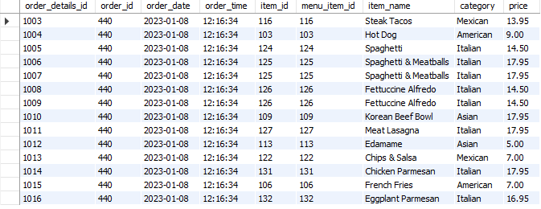
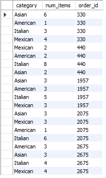

# Restaurant Order Analysis with SQL

## Project Overview
In this project, I analyzed a restaurant order dataset using SQL to understand customer ordering behavior and sales patterns.

The analysis focuses on:
- Order frequency
- Item popularity
- Category-level demand
- High spending customers

The goal is to extract business insights that can help restaurants optimize menu strategy and increase revenue.

## Technologies Used

- SQL
- PostgreSQL / MySQL
- Data Analysis
- GitHub

## Dataset

The dataset contains two main tables:

### order_details
Contains information about each item in every order.

| Column | Description |
|------|------|
| order_details_id | Unique ID for each order item |
| order_id | Order identifier |
| order_date | Date of the order |
| item_id | Ordered menu item |

### menu_items
Contains information about the restaurant menu.

| Column | Description |
|------|------|
| menu_item_id | Item ID |
| item_name | Name of the menu item |
| category | Food category |
| price | Price of the item |


## Business Questions

1. What is the date range of the dataset?
2. How many orders were made?
3. How many items were ordered in total?
4. Which orders had the most items?
5. How many orders contained more than 12 items?
6. What are the least and most ordered menu items?
7. Which categories are most popular?
8. Which orders generated the highest revenue?
9. What items were included in the highest spending orders?

-- What is the date range of the table?
```sql
SELECT MIN(order_date), MAX(order_date)
FROM order_details;
```


-- Top 5 highest spending orders
```sql
SELECT order_id, SUM(price) AS total_spend
FROM order_details od
LEFT JOIN menu_items mi
    ON mi.menu_item_id = od.item_id
GROUP BY order_id
ORDER BY total_spend DESC
LIMIT 5;
```

## Key Insights

- The dataset contains orders between **January and March**.
- A total of **X orders** were placed during this period.
- Some orders contained more than **12 items**, indicating large group orders.
- The most frequently ordered items belong mainly to the **Italian category**.
- The highest spending order reached **$192.15**.
- High spending orders often contain items from multiple categories.



